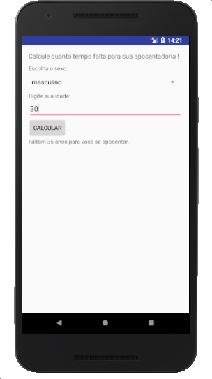
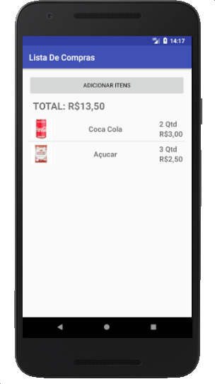
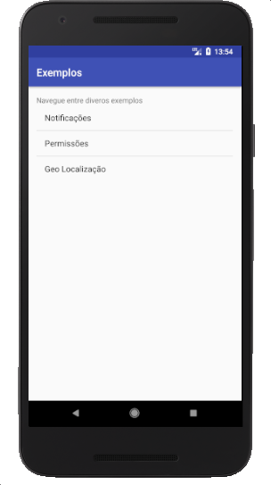

# Kotlin na prática

Este repositório contem os códigos utilizados no link Kotlin na prática. Você pode encontrar o link em: http://casadocodigo.com.br

## Projeto - Hello World

O projeto Hello World é o primeiro contato com a programação em Kotlin e a plataforma Android que o leitor terá, neste projeto implementamos funções básicas como o clique de um botão e atualização de conteúdo na tela.

## Projeto - Calculadora de aposentadoria

Este é de fato o promeiro projeto do livro, aqui o leitor irá desenvolver um aplicativo que calcule quanto tempo falta para uma pessoa se aposentar de acordo com as regras vigentes. Para isso o App deve levar em conta a idade atual e o sexo da pessoa. Neste projeto o leitor aprenderá os principais componentes visuais do Android como `TextView`, `EditText`, `Button` e `Spinner`, também aprenderá como definir ações para um botão e como dar um feedback visual ao usuário.

## Projeto - Lista de Compras 

Esse projeto o leitor irá implementar um aplicativo de lista de compras, esse aplicativo utliza o componente `ListView` que é um dos principais componentes do Android. A construção do App é dividida em 3 partes, primeiro o leitor irá implementar a lista de compras de uma forma simples, um aplicativo de única tela (Single Activity). 

Na segunda parte o leitor irá implementar uma `ListView` customizada ao aplicativo e deixará separado a parte de inserir novos itens da parte de visualização de itens já inseridos. Essa `ListView` customizada além de exibir o nome do produto irá exibir o preço, a quantidade e também uma foto! Para o armazenamento da foto do produto o leitor irá aprender como pegar uma imagem da galeria do celular. 

Na terceira parte desse App o leitor irá trabalhar com o banco de dados sqlite e com a biblioteca Anko para fazer a persistencia dos dados, o leitor irá implementar as operações básicas de uma banco de dados.

## Projeto - Calculadora de Bitcoin

Neste projeto o leitor irá implementar um App de calculadora de Bitcoin! Esse App acessa dados de cotação em tempo real da internet através da API do Mercado Bitcoin e efetua calculos de conversão.

Aqui o leitor irá aprender a trablahar com tarefas assincronas e como executar requisições simples a uma API na internet, também aprenderá a tratar o retorno de APIs em JSON através da linguagem Kotlin.

## Exemplos: Notificações, permissões e localização

Dentro do projeto "Exemplos" você encontrará exemplos de impelmentação dessas 3 funcionalidades: Notificação, Requisição de permissões e requisição de localização. Todos os exemplos utilizam os códigos descritos no livro.

